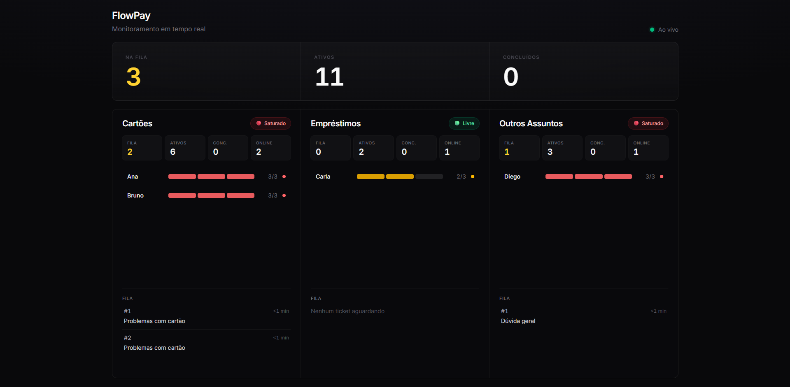

# FlowPay Attendance Manager

Sistema desenvolvido para gerenciar a distribuição de tickets de atendimento entre equipes, respeitando regras de roteamento, capacidade máxima por atendente e fila FIFO.

O projeto foi desenvolvido como solução para um desafio técnico Full Stack, contemplando uma API REST para gerenciamento dos atendimentos e um dashboard em tempo real para acompanhamento operacional.

<p align="center">
  
</p>

## Início rápido

```bash
npm install
npm run dev
```

Instruções completas em [Como executar](#como-executar).

---

# Índice

- [Processo de desenvolvimento](#processo-de-desenvolvimento)
- [Funcionalidades](#funcionalidades)
- [Tecnologias](#tecnologias)
- [Decisões técnicas](#decisões-técnicas)
- [Arquitetura](#arquitetura)
- [Fluxo da aplicação](#fluxo-da-aplicação)
- [Regras de negócio](#regras-de-negócio)
- [Pré-Requisitos](#pré-requisitos)
- [Como executar](#como-executar)
- [API](#api)
- [Testes](#testes)
- [Possíveis melhorias](#possíveis-melhorias)
- [Requisitos atendidos](#requisitos-atendidos)

---

# Processo de desenvolvimento

O projeto foi desenvolvido seguindo uma abordagem de **Spec-Driven Development (SDD)**.

Antes da implementação, foi elaborada uma especificação contendo os requisitos funcionais, regras de negócio, arquitetura, fluxos da aplicação e critérios de aceitação.

Essa documentação serviu como guia durante todo o desenvolvimento, permitindo implementar as funcionalidades de forma incremental e mantendo alinhamento entre os requisitos definidos e a solução construída.

## Os documentos utilizados durante essa etapa encontram-se na pasta `spec/`.

# Funcionalidades

- Criação de tickets
- Roteamento automático por assunto
- Distribuição para o atendente com menor carga
- Limite de 3 atendimentos simultâneos por agente
- Fila FIFO quando todos os agentes estiverem ocupados
- Reatribuição automática após conclusão de um atendimento
- Dashboard atualizado em tempo real
- API REST para gerenciamento dos tickets

---

# Tecnologias

## Backend

- NestJS
- TypeScript
- Socket.IO
- Jest

## Frontend

- React
- Vite
- Tailwind CSS

---

# Decisões técnicas

## NestJS

Escolhi o NestJS por oferecer uma estrutura modular que se encaixa muito bem nesse tipo de problema.

Como a aplicação possui responsabilidades bem definidas (tickets, agentes, roteamento e dashboard), foi possível separar cada domínio em módulos independentes, facilitando tanto a organização quanto futuras evoluções.

Outro ponto importante foi a injeção de dependências, que deixou a lógica de distribuição desacoplada e mais simples de testar.

Além disso, o suporte nativo ao Socket.IO facilitou bastante a implementação da comunicação em tempo real com o dashboard.

---

## TypeScript

Como toda a lógica da aplicação gira em torno de regras de negócio (capacidade máxima, fila FIFO, distribuição automática e estados dos tickets), utilizar TypeScript ajuda a modelar melhor o domínio e reduz a possibilidade de erros durante o desenvolvimento.

Enums, interfaces e tipagem forte deixaram as regras mais claras e fáceis de manter.

---

## React + Vite

Para o dashboard optei pelo React pela facilidade de dividir a interface em componentes reutilizáveis.

Cada parte da tela representa uma responsabilidade específica, como indicadores, equipes, atendentes e filas, tornando a interface simples de evoluir.

O Vite foi escolhido por oferecer um ambiente de desenvolvimento extremamente rápido, além de uma configuração simples para integração com a API.

---

## Tailwind CSS

Utilizei Tailwind CSS para acelerar o desenvolvimento da interface e manter um padrão visual consistente.

---

## Socket.IO

O dashboard precisava refletir as mudanças dos atendimentos em tempo real.

Em vez de utilizar polling periódico, optei pelo Socket.IO.

Sempre que um ticket é criado ou concluído, o backend envia um novo snapshot para todos os clientes conectados, mantendo a interface sincronizada automaticamente.

---

## Armazenamento em memória

Como o desafio não exigia persistência, optei por manter todos os dados em memória. Essa abordagem simplifica a aplicação, reduz a complexidade da infraestrutura e permite concentrar o desenvolvimento nas regras de negócio propostas.

Além disso, a arquitetura foi organizada de forma que a substituição por um banco de dados possa ser realizada futuramente com baixo impacto na lógica da aplicação.

---

# Arquitetura

```
flowpay-attendance-manager
│
├── src
│   ├── agents
│   ├── dashboard
│   ├── domain
│   ├── events
│   ├── routing
│   └── tickets
│
├── client
│   └── src
│       ├── api
│       ├── components
│       └── hooks
│
├── test
├── spec
└── postman
```

A aplicação foi organizada por domínio, separando responsabilidades para facilitar manutenção e evolução do projeto.

Cada módulo possui uma responsabilidade específica:

- `agents`: gerenciamento dos atendentes e capacidade de atendimento.
- `tickets`: criação, atualização e conclusão dos tickets.
- `routing`: regras de roteamento e distribuição.
- `dashboard`: geração do resumo consumido pelo frontend.
- `events`: comunicação em tempo real via Socket.IO.
- `domain`: entidades, enums e regras compartilhadas.

---

# Fluxo da aplicação

Quando um ticket é criado:

1. A API identifica o assunto.
2. O ticket é roteado para a equipe correta.
3. É procurado o atendente da equipe com menor carga.
4. Caso exista capacidade disponível, o ticket é atribuído imediatamente.
5. Caso todos estejam ocupados, o ticket entra na fila FIFO daquela equipe.

Quando um atendimento é concluído:

1. O ticket recebe status `COMPLETED`.
2. A capacidade do atendente é liberada.
3. O primeiro ticket da fila é automaticamente distribuído.
4. O dashboard recebe uma atualização em tempo real.

---

# Regras de negócio

## Roteamento


| Assunto                   | Equipe          |
| ------------------------- | --------------- |
| Problemas com cartão      | Cartões         |
| Contratação de empréstimo | Empréstimos     |
| Demais assuntos           | Outros Assuntos |


---

## Atendentes


| Agente | Equipe          |
| ------ | --------------- |
| Ana    | Cartões         |
| Bruno  | Cartões         |
| Carla  | Empréstimos     |
| Diego  | Outros Assuntos |


Cada atendente pode possuir no máximo **3 atendimentos ativos** simultaneamente.

Quando todos os atendentes de uma equipe atingem esse limite, novos tickets entram em uma fila FIFO.

---

# Pré-requisitos

Antes de executar o projeto, certifique-se de ter instalado:

| Requisito | Versão mínima | Observação |
|-----------|---------------|------------|
| [Node.js](https://nodejs.org/) | **22.12+** (recomendado) | Necessário para `npm run dev` (API + frontend) |
| npm | **10+** | Incluído na instalação do Node.js |

Verifique as versões instaladas:

```bash
node -v
npm -v
```

---

# Como executar

## Instalar dependências

```bash
npm install
```

O projeto instala automaticamente as dependências do frontend durante o `postinstall`.

---

## Desenvolvimento

API + Frontend

```bash
npm run dev
```

Serviços disponíveis:


| Serviço   | Endereço                                       |
| --------- | ---------------------------------------------- |
| API       | [http://localhost:3000](http://localhost:3000) |
| Dashboard | [http://localhost:5173](http://localhost:5173) |


---

## Apenas API

```bash
npm run start:dev
```

---

## Apenas Frontend

```bash
npm run dev:web
```

---

# API

Base URL

```
http://localhost:3000/api
```

---

## Criar ticket

```http
POST /tickets
```

```json
{
  "subject": "Problemas com cartão"
}
```

**Resposta (201) — atribuído imediatamente:**

```json
{
  "id": "8e6d44f5-4d56-4e0b-a20d-1c80e8c0c5ab",
  "subject": "Problemas com cartão",
  "team": "CARTOES",
  "status": "ASSIGNED",
  "agentId": "agent-1",
  "createdAt": "2026-06-25T12:00:00.000Z",
  "queuePosition": null
}
```

**Resposta (201) — fila cheia:**

```
{
  "id": "8e6d44f5-4d56-4e0b-a20d-1c80e8c0c5ab",
  "subject": "Problemas com cartão",
  "team": "CARTOES",
  "status": "QUEUED",
  "agentId": null,
  "createdAt": "2026-06-25T12:00:00.000Z",
  "queuePosition": 1
}
```

---

## Concluir ticket

```http
PATCH /tickets/:id/complete
```

**Resposta:**

```
{
  "id": "1f639caa-bbdb-4306-8cc6-db50c9852ccf",
  "subject": "Problemas com cartão",
  "team": "CARTOES",
  "status": "COMPLETED",
  "agentId": null,
  "createdAt": "2026-06-26T02:14:08.678Z",
  "queuePosition": null
}
```

---

## Dashboard

```http
GET /dashboard/summary
```

Retorna os indicadores gerais e o estado atual de todas as equipes.

```json
{
  "totalQueued": 2,
  "totalActive": 5,
  "totalCompleted": 10,
  "queuesByTeam": {
    "CARTOES": { "queued": 1, "active": 3, "completed": 4, "agentsOnline": 2, "agents": [], "waiting": [], "assigned": [] },
    "EMPRESTIMOS": { ... },
    "OUTROS": { ... }
  }
}
```

---

## WebSocket

```
ws://localhost:3000/dashboard
```

Evento emitido:

```
dashboard.summary
```

Sempre que ocorre alguma alteração nos atendimentos.

---

# Testes

Executar:

```bash
npm run test:e2e
```

Os testes cobrem os principais cenários da aplicação:

- roteamento por assunto;
- distribuição automática;
- capacidade máxima por atendente;
- fila FIFO;
- reatribuição automática;
- endpoint do dashboard.

---

# Possíveis melhorias

Caso o projeto evoluísse além do escopo do desafio, alguns pontos que poderiam ser adicionados seriam:

- persistência em banco de dados;
- autenticação de usuários;
- múltiplas filas por prioridade;
- histórico completo de atendimentos;
- Docker e Docker Compose;
- observabilidade (logs e métricas);
- testes unitários adicionais.

---

# Requisitos atendidos


| Requisito                 | Status |
| ------------------------- | ------ |
| Criação de tickets        | ✅      |
| Roteamento automático     | ✅      |
| Distribuição por carga    | ✅      |
| Limite de 3 atendimentos  | ✅      |
| Fila FIFO                 | ✅      |
| Reatribuição automática   | ✅      |
| Dashboard                 | ✅      |
| Atualização em tempo real | ✅      |


---

# Considerações finais

O foco deste projeto foi implementar corretamente as regras de negócio propostas no desafio, mantendo uma arquitetura simples, organizada e fácil de evoluir.

Toda a lógica de distribuição permanece desacoplada da camada de apresentação, permitindo alterar regras futuras sem impactar a API ou o dashboard.